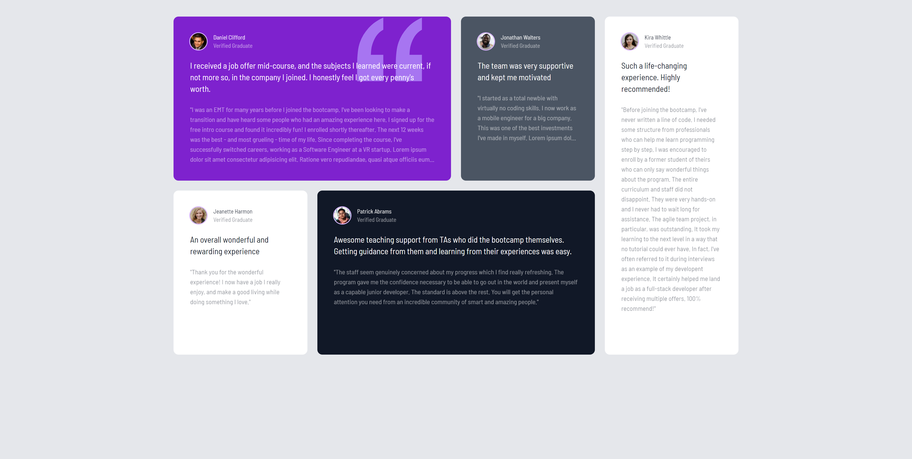

# TestimonialGridTraining

This README outlines the structure of the `index.html` file for the TestimonialGridTraining project, featuring a grid layout of testimonials using Tailwind CSS for styling.

## Table of Contents
1. [Overview](#overview)
2. [Head Section](#head-section)
3. [Global Container](#global-container)
4. [Grid Layout](#grid-layout)
5. [Testimonial Boxes](#testimonial-boxes)
6. [Conclusion](#conclusion)

## Overview

The project presents testimonials from graduates in a responsive grid format, highlighting their experiences in a bootcamp setting.

## Head Section

The head section includes links to stylesheets and fonts.

### Key Elements:
- **Stylesheet**: `style.css` - Contains custom styles.
- **Favicon**: A shortcut icon for the site.
- **Fonts**: Utilizes Google Fonts for typography.

## Global Container

The global container uses Tailwind CSS for layout and padding.

### Key Tailwind Classes:
- `container mx-auto max-w-7xl p-2 md:p-10` - Centers the content with responsive padding.

## Grid Layout

The layout employs a grid system to organize testimonials.

### Key Tailwind Classes:
- `grid gap-6 grid-cols-1 md:grid-cols-4 md:grid-rows-2 text-white` - Creates a responsive grid with gaps between items.

## Testimonial Boxes

Each testimonial box includes an image, name, and testimonial text. 

### Box Details:
1. **Box 1**:
   - **Background**: `bg-purple-700`
   - **Quote Image**: Positioned absolutely within the box.
   - **Content**: Features a large text quote and smaller details.

2. **Box 2**:
   - **Background**: `bg-gray-600`
   - **Content**: Similar structure to Box 1 but with different text.

3. **Box 3**:
   - **Visibility**: Hidden on small screens (`hidden md:block`).
   - **Content**: Longer testimonial text from Kira Whittle.

4. **Box 4**:
   - **Background**: `bg-white`
   - **Content**: A straightforward testimonial with a clean design.

5. **Box 5**:
   - **Background**: `bg-gray-900`
   - **Content**: Another positive testimonial, focusing on teaching support.

6. **Box 6**:
   - **Visibility**: Shown only on small screens (`md:hidden`).
   - **Content**: Replicates Box 3 for smaller screens to ensure accessibility.

  
