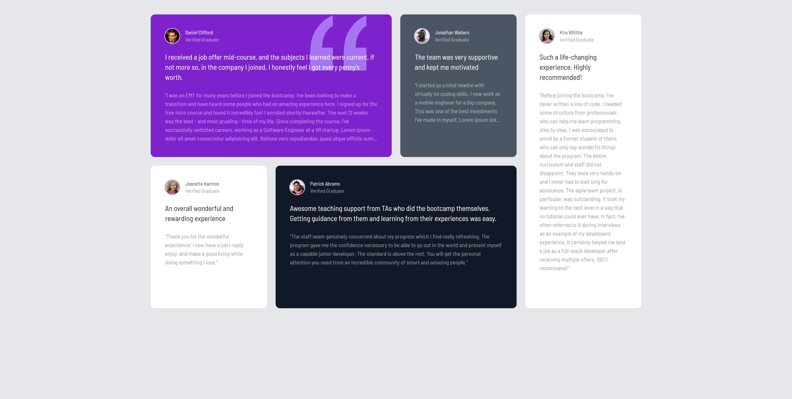

# testimonialGridTraining

Este README descreve a estrutura do arquivo `index.html` para o projeto TestimonialGridTraining, que apresenta um layout em grade de depoimentos usando Tailwind CSS para estilização.

## Tabela de Conteúdos
1. [Overview](#overview)
2. [Head Section](#head-section)
3. [Global Container](#global-container)
4. [Grid Layout](#grid-layout)
5. [Testimonial Boxes](#testimonial-boxes)
6. [Conclusion](#conclusion)

## Overview

O projeto apresenta depoimentos de graduados em um formato de grade responsivo, destacando suas experiências em um bootcamp.

## Head Section

A seção head inclui links para folhas de estilo e fontes.

### Elementos Principais:
- **Stylesheet**: `style.css` - Contém estilos personalizados.
- **Favicon**: Um ícone de atalho para o site.
- **Fonts**: Utiliza Google Fonts para tipografia.

## Global Container

O container global usa Tailwind CSS para layout e padding.

### Principais Classes Tailwind:
- `container mx-auto max-w-7xl p-2 md:p-10` - Centraliza o conteúdo com padding responsivo.

## Grid Layout

O layout emprega um sistema de grade para organizar os depoimentos.

### Principais Classes Tailwind:
- `grid gap-6 grid-cols-1 md:grid-cols-4 md:grid-rows-2 text-white` - Cria uma grade responsiva com espaços entre os itens.

## Testimonial Boxes

Cada caixa de depoimento inclui uma imagem, nome e texto do depoimento.

### Detalhes das Caixas:
1. **Box 1**:
   - **Background**: `bg-purple-700`
   - **Quote Image**: Posicionada absolutamente dentro da caixa.
   - **Content**: Apresenta uma grande citação em texto e detalhes menores.

2. **Box 2**:
   - **Background**: `bg-gray-600`
   - **Content**: Estrutura semelhante à Box 1, mas com texto diferente.

3. **Box 3**:
   - **Visibility**: Oculta em telas pequenas (`hidden md:block`).
   - **Content**: Texto de depoimento mais longo de Kira Whittle.

4. **Box 4**:
   - **Background**: `bg-white`
   - **Content**: Um depoimento simples com um design limpo.

5. **Box 5**:
   - **Background**: `bg-gray-900`
   - **Content**: Outro depoimento positivo, focando no suporte ao ensino.

6. **Box 6**:
   - **Visibility**: Exibida apenas em telas pequenas (`md:hidden`).
   - **Content**: Replica a Box 3 para telas menores, garantindo acessibilidade.
